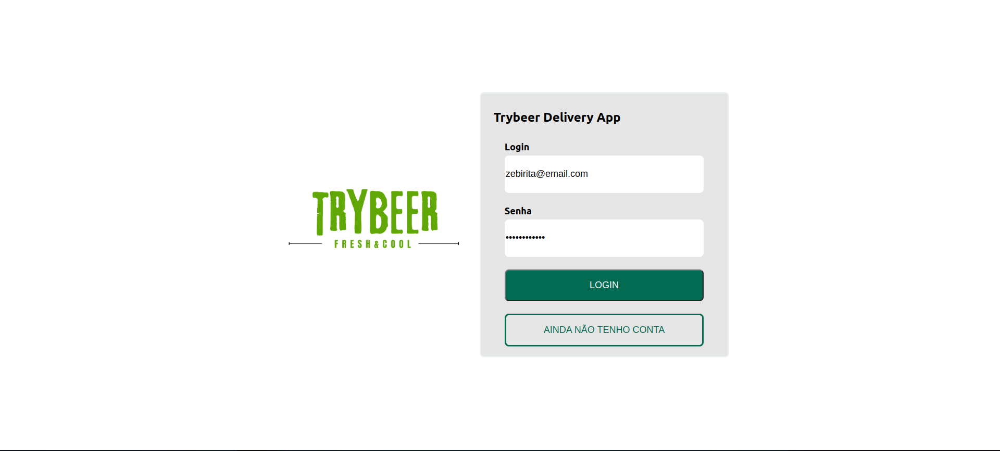
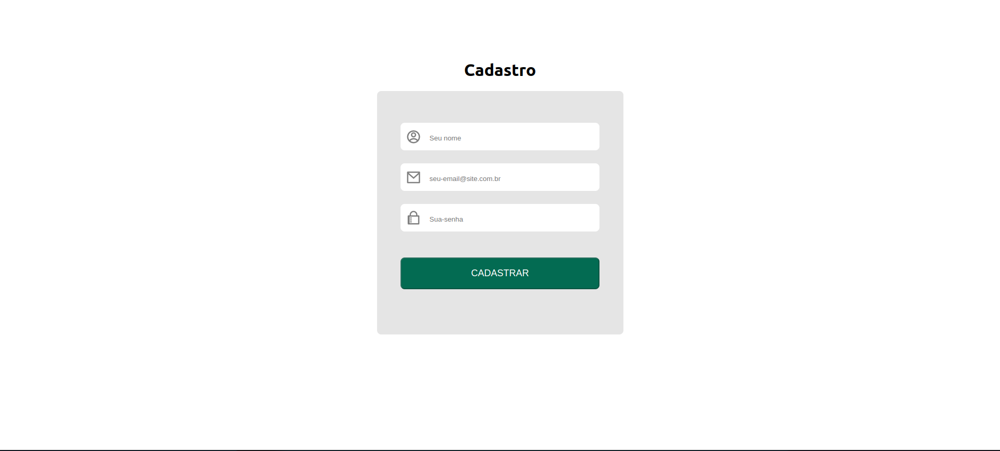
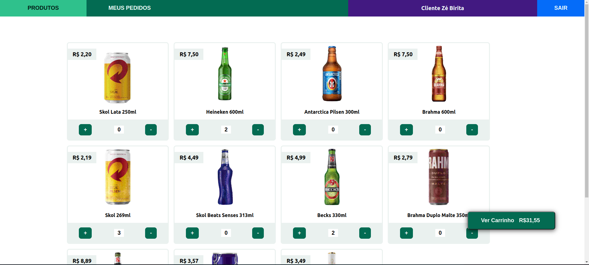
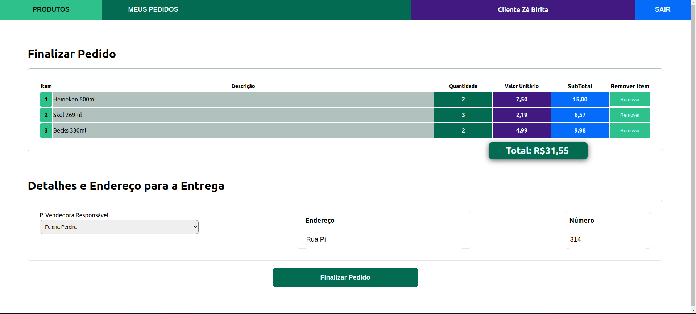
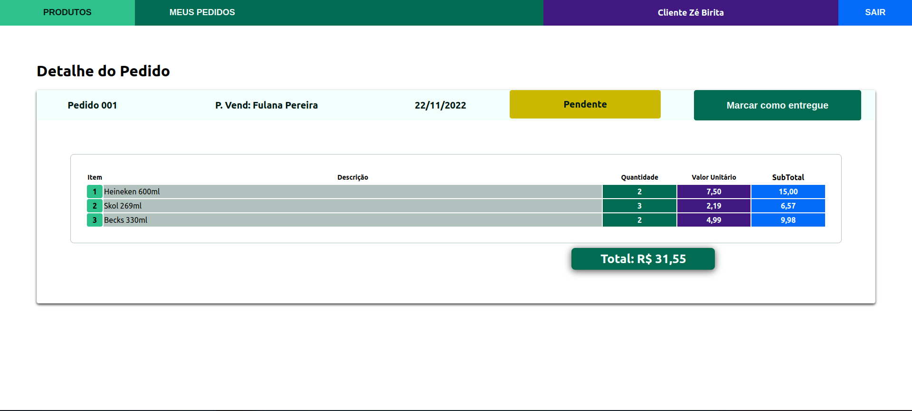
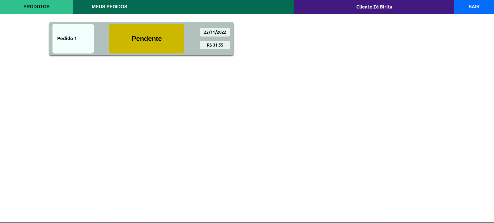
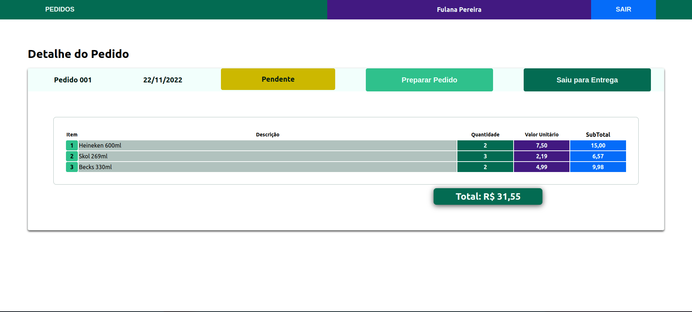
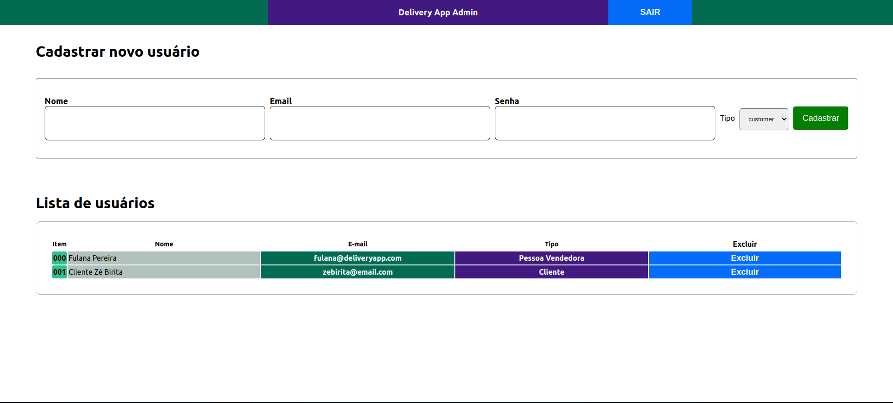

<h1 align="left">Trybeer Delivery App</h1>

###

<p align="left">This full-stack project aimed to create an e-commerce that simulates a beverage distributor, making it possible to create accounts, log in, access a product screen to purchase them, checkout screen, order screens and update status of that order. Furthermore, if the user is an administrator type, it is possible to create new users (customer or seller) and also remove them.<br><br>The Front-end was made using React.js with Hooks and styled-components to the styling. Back-end was made using Node.js, Express and Sequelize as ORM. The database used was MySQL.<br><br>Both ends of the application have tests that cover practically all the lines of their respective folders, the Front-end being made with Jest and React Testing Library and the Back-end made with Mocha, Chai and Sinon.</p>

###

<h2 align="left">Technologies used</h2>

###

<div align="left">
  
  
  
  
  
  
  
  
  
</div>

###

<h2 align="left">How to use the application</h2>

###

Clone the application using the `git clone` command. After that, enter the project folder using the `cd trybeer-delivery-app` command.

###

<h2 align="left">Required settings</h2>

###

- `node` from version `16.0.0 LTS`
- `docker-compose` from version `2.5.0`

###

<h2 align="left">Running the application with Docker</h2>

###

In the root folder of the project, use the `docker-compose up -d` command. The Front-end will be located on port 3000, the Back-end on port 3001 and the database (MySQL) on port 3002.
###

<h2 align="left">Running the application locally</h2>

###

To run locally, it is necessary to run the `npm install` command both in the Front-end folder and in the Back-end folder. In addition, you need to put your database credentials in the `./back-end/.env.example` file and then rename the files to just `.env` . After the settings are done, just use the ` command npm start` in each folder.

###

<h2 align="left">About the database</h2>

When starting the services through `docker-compose` or `npm start` in the Back-end, 3 users will be created, which are these:

```JavaScript
[
  {
    email: 'adm@deliveryapp.com',
    password: '--adm2@21!!--',
    role: 'administrator',
  },
  {
    email: 'fulana@deliveryapp.com',
    password: 'fulana@123',
    role: 'seller',
  },
  {
    email: 'zebirita@email.com',
    password: '$#zebirita#$',
    role: 'customer',
  },
],
```

Depending on the user that will be used in the login, the application will take you to different screens.

###

<h2 align="left">Screens</h2>

<table>
  <tr>
    <td width="300px">
      <h2>Login</h2>
      
    </td>
    <td width="300px">
      <h2>Register</h2>
      
    </td>
    <td width="300px">
      <h2>Products</h2>
      
    </td>
  </tr>
  <tr>
    <td  width="300px">
      <h2>Checkout</h2>
      
    </td>
    <td width="300px">
      <h2>Order Details (Client)</h2>
      
    </td>
    <td width="300px">
      <h2>Orders List</h2>
      
    </td>
  </tr>
  <tr>
    <td width="300px">
      <h2>Order Details (Seller)</h2>
      
    </td>
    <td width="300px">
      <h2>User Management (Admin)</h2>
      
    </td>
  </tr>
</table>

###

<h2 align="left">Notes when registering a user</h2>

To register a new user, the user must meet the following conditions:

- `Email` with valid format ```(user@email.com)```
- `Name` with at least 12 characters
- `Password` with at least 6 characters

<h2 align="left">Thanks</h2>

I would like to thank my colleagues [Klaus Lübe](https://www.linkedin.com/in/klauslube/), [ Lindoelson Lopes](https://www.linkedin.com/in/joselindoelsonlopes/), [Caio Imbroisi ](https://www.linkedin.com/in/caio-imbroisi/) and [Daniel Coelho](https://www.linkedin.com/in/daniel-alves-coelho/) for developing this project with me !
